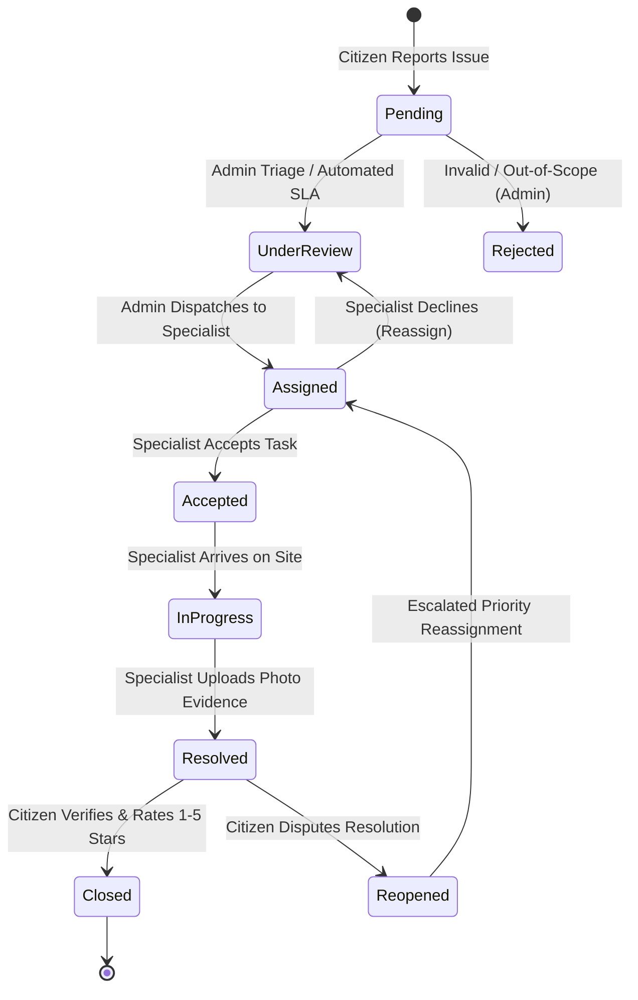

# FixIt — Production Full-Stack MERN Civic Issue & Service Management Platform


FixIt is a production-grade full-stack MERN (MongoDB, Express.js, React, Node.js) web application designed to solve the real-world challenge of local civic issue reporting, municipal field worker dispatching, real-time lifecycle tracking, and transparent citizen verification.

---

## 1. Problem Statement & Solution

### The Challenge
In traditional municipalities and housing communities:
- Citizens lack a unified, transparent platform to report potholes, live wire hazards, garbage heaps, or water leaks.
- Field crews receive vague textual descriptions without exact geographic coordinates or photographic evidence.
- Complaints often sit stagnant with no SLA enforcement or get marked as "closed" without citizen verification.

### The FixIt Solution
- **Zero-Friction Incident Reporting**: Citizens pinpoint issues on an interactive map with GPS auto-location and multi-photo upload.
- **Smart Priority Engine**: Algorithmic heuristic analysis assigns urgency tiers (*Critical*, *High*, *Medium*, *Low*) and enforces strict resolution SLAs.
- **Role-Based Portals**: Dedicated operational workspaces for **Citizens**, **Field Specialists (Workers)**, and **City Administrators**.
- **Real-Time WebSockets & Notifications**: Powered by Socket.IO and Nodemailer for live status updates, direct discussions, and dispatch alerts.
- **Resolution Verification & Feedback**: Citizens review before/after photographic proof and submit 1–5 star ratings before a ticket is closed.

---

## 2. System Architecture

```mermaid
graph TD
    subgraph Client ["Frontend (React 18 + Vite)"]
        UI["Modern Responsive UI / CSS Design System"]
        Maps["Interactive Leaflet / OpenStreetMap"]
        Charts["Recharts Analytics Visualizations"]
        Sockets["Socket.IO Client (Real-Time Events)"]
    end

    subgraph Server ["Backend (Node.js + Express)"]
        Router["RESTful API Gateway & RBAC Middleware"]
        Priority["Smart Priority & SLA Calculation Engine"]
        IO["Socket.IO Server (Room-based Broadcasts)"]
        Mailer["Nodemailer Email Service"]
        Cloudinary["Cloudinary Multi-Image Pipeline"]
    end

    subgraph Storage ["Database & Cloud Services"]
        Mongo[("MongoDB Atlas (GeoJSON, Aggregations)")]
        Media["Cloudinary / Static Media Storage"]
        SMTP["SMTP / Ethereal Mail Server"]
    end

    UI -->|HTTPS / REST| Router
    Sockets <-->|WebSockets (wss://)| IO
    Router --> Priority
    Router -->|Mongoose Queries| Mongo
    Router -->|Upload Streams| Media
    Router -->|Dispatch Alerts| SMTP
    IO --> Sockets
```

---

## 3. Complaint Lifecycle State Machine



---

## 4. User Roles & Capabilities

### 👨‍💼 Citizen / Resident Portal
- **Interactive Report Flow**: Multi-image upload, interactive OpenStreetMap pin placement, GPS geolocation, and reverse geocoding to street address.
- **Live Smart Priority Preview**: Instant feedback on calculated severity as the citizen types.
- **Real-Time Tracking**: Visual horizontal step timeline (`Submitted → Reviewed → Assigned → In Progress → Resolved → Closed`).
- **Two-Way Discussion**: In-app discussion thread with assigned field specialists and dispatchers.
- **Resolution Sign-Off**: Mandatory verification modal with 5-star service rating and quality feedback.

### 👷 Field Specialist (Worker) Portal
- **Task Dispatch Board**: Real-time incoming task notifications with SLA deadlines.
- **Task Acceptance Workflow**: Accept tasks or decline with technical justification notes.
- **Status Lifecycle Control**: Mark tickets `In Progress` and `Resolved`.
- **Evidence Uploader**: Upload before-and-after photographic evidence and technical notes.
- **Performance & Reviews**: Track personal completion velocity, SLA turnaround times, and verified citizen ratings.

### 🏛️ Municipal Administrator Command Center
- **Executive Operations Dashboard**: High-level KPIs, resolution rate percentages, and mean duration metrics.
- **Deep-Dive Aggregations & Recharts**: Category distribution bar charts, status donut charts, and monthly resolution trends.
- **Citywide Geospatial Map**: Interactive Leaflet map displaying active complaints across all city wards with status-colored pins.
- **Specialist Roster & Load Balancer**: View active workloads, reassign tasks, and balance field capacity.
- **Priority Override**: Manually adjust automated priority scores with audit log reasons.
- **Category & SLA Manager**: CRUD categories with customized SLA target hours and default priorities.
- **System Audit Logs**: Immutable activity log stream recording all logins, dispatch assignments, and status transitions.

---

## 5. Technology Stack

| Layer | Technologies |
| :--- | :--- |
| **Frontend** | React 18, React Router v6, Pure JavaScript/JSX, Vite |
| **Styling & UI** | Modern CSS Design Tokens, Custom Glassmorphism, CSS Grid, Lucide Icons |
| **Maps & Geo** | Leaflet, React-Leaflet, OpenStreetMap TileLayer, Nominatim Reverse Geocoding |
| **Charts & KPIs** | Recharts (ResponsiveContainer, BarChart, PieChart, AreaChart, CartesianGrid) |
| **Backend API** | Node.js, Express.js (Modular MVC + Service Layer) |
| **Database** | MongoDB + Mongoose (GeoJSON 2dsphere indexes, Aggregation Pipelines) |
| **Authentication** | JWT (JSON Web Tokens), bcryptjs password hashing, RBAC Middleware |
| **Real-Time Push** | Socket.IO (Authenticated connection with room namespaces) |
| **Media Upload** | Cloudinary API + Multer (with built-in local fallback) |
| **Email Service** | Nodemailer (with Ethereal / simulated mode fallback) |
| **Testing** | Jest, Supertest, MongoDB Memory Server |

---

## 6. Project Structure

```text
fixit/
├── package.json                   # Root orchestrator scripts
├── README.md                      # Complete system documentation
├── server/                        # Node.js + Express Backend
│   ├── src/
│   │   ├── config/                # DB, Cloudinary, Mailer, Socket.IO, Constants
│   │   ├── models/                # User, Complaint, Category, Comment, Notification, Rating, ActivityLog
│   │   ├── middleware/            # JWT Auth, RBAC, Error Handling, Multer, Rate Limiting, Validation
│   │   ├── controllers/           # Auth, Complaint, Worker, Admin, Category, Comment, Notification
│   │   ├── routes/                # Express API Route handlers
│   │   ├── services/              # Smart Priority Engine, Email Templates, Socket Alerts, Aggregations
│   │   ├── utils/                 # ApiResponse, AsyncHandler, Logger, Seed Data Script
│   │   ├── tests/                 # Jest & Supertest automated integration tests
│   │   ├── app.js                 # Express application configuration
│   │   └── server.js              # Server bootstrapper & listener
│   ├── .env.example
│   └── package.json
└── client/                        # React 18 + Vite Frontend
    ├── src/
    │   ├── assets/                # Design assets
    │   ├── components/
    │   │   ├── common/            # Navbar, Sidebar, Button, Input, Modal, Badge, Card, Table, Pagination, Loader, Toast
    │   │   ├── complaints/        # MapPicker, MapViewer, StatusTimeline, MultiImageUploader, ResolutionModal, RatingModal
    │   │   ├── dashboard/         # StatCard, AnalyticsCharts, WorkerLeaderboard, ComplaintGeoMap
    │   │   └── notifications/     # NotificationDropdown
    │   ├── context/               # AuthContext, SocketContext, NotificationContext, ToastContext
    │   ├── hooks/                 # useAuth, useSocket, useNotifications, useToast, useGeolocation, useDebounce
    │   ├── services/              # Centralized Axios API services
    │   ├── pages/
    │   │   ├── public/            # HomePage, AboutPage, HowItWorksPage, ContactPage, LoginPage, RegisterPage, NotFoundPage
    │   │   ├── user/              # UserDashboard, CreateComplaintPage, MyComplaintsPage, ComplaintDetailPage, ProfilePage, SettingsPage
    │   │   ├── worker/            # WorkerDashboard, AssignedTasksPage, TaskDetailPage, WorkHistoryPage, WorkerPerformancePage
    │   │   └── admin/             # AdminDashboard, ComplaintManagementPage, UserManagementPage, WorkerManagementPage, CategoryManagementPage, AnalyticsPage, ActivityLogsPage
    │   ├── routes/                # AppRoutes, ProtectedRoute
    │   ├── styles/                # CSS Design System tokens, animations, responsive grid
    │   ├── App.jsx
    │   └── main.jsx
    ├── index.html
    ├── vite.config.js
    └── package.json
```

---

## 7. REST API Reference

### Authentication (`/api/auth`)
- `POST /api/auth/register` — Register a new Citizen or Field Specialist
- `POST /api/auth/login` — Sign in and obtain JWT
- `POST /api/auth/logout` — Invalidate session
- `GET /api/auth/me` — Retrieve current authenticated user profile
- `PUT /api/auth/profile` — Update name, phone, bio, worker skills
- `PUT /api/auth/update-password` — Change account password
- `POST /api/auth/avatar` — Upload profile photo

### Complaints & Lifecycle (`/api/complaints`)
- `GET /api/complaints` — Search & filter all public complaints (pagination, category, status, priority)
- `POST /api/complaints` — Submit new complaint (with multi-image upload and GPS coordinates)
- `GET /api/complaints/my` — Get user's submitted complaints
- `GET /api/complaints/:id` — Get comprehensive complaint details with timeline
- `PUT /api/complaints/:id` — Update complaint details (while in Pending status)
- `DELETE /api/complaints/:id` — Delete complaint (while in Pending status)
- `POST /api/complaints/:id/reopen` — Citizen disputes resolution
- `POST /api/complaints/:id/close` — Citizen verifies resolution
- `POST /api/complaints/:id/rating` — Citizen submits 1–5 star service rating
- `GET /api/complaints/:id/comments` — Retrieve discussion comments
- `POST /api/complaints/:id/comments` — Post new comment / internal note

### Worker Operations (`/api/workers`)
- `GET /api/workers/tasks` — List assigned tasks for logged-in specialist
- `GET /api/workers/tasks/:id` — Retrieve task details
- `POST /api/workers/tasks/:id/accept` — Accept task assignment
- `POST /api/workers/tasks/:id/reject` — Decline task assignment with reason
- `PUT /api/workers/tasks/:id/status` — Set status `In Progress` or `Resolved` (with before/after photos)
- `GET /api/workers/stats` — Retrieve personal turnaround and customer satisfaction KPIs
- `GET /api/workers/history` — Get work history archive

### Admin Command (`/api/admin`)
- `GET /api/admin/dashboard` — Fetch master dashboard metrics and aggregation charts
- `POST /api/admin/complaints/:id/assign` — Dispatch task to specialist
- `PUT /api/admin/complaints/:id/priority` — Manually override priority level
- `PUT /api/admin/complaints/:id/status` — Transition complaint status directly
- `GET /api/admin/users` — Search citizen directory
- `PUT /api/admin/users/:id/status` — Suspend or reactivate user account
- `GET /api/admin/workers` — View all field specialists and active workloads
- `GET /api/admin/activity-logs` — Retrieve system audit trail

---

## 8. Database Seeding & Demo Accounts

The project includes a rich database seeding script with pre-configured accounts across all three user roles, realistic civic issue coordinates, before/after resolution photos, discussion threads, and customer reviews.

### Demo Credentials:

| Role | Email | Password | Description |
| :--- | :--- | :--- | :--- |
| **Administrator** | `admin@fixit.com` | `Admin@123` | City Dispatch Supervisor with full permissions |
| **Field Specialist 1** | `worker.roads@fixit.com` | `Worker@123` | Roads & Highways Specialist (Rating: 4.9 ★) |
| **Field Specialist 2** | `worker.electric@fixit.com` | `Worker@123` | High-Voltage & Streetlights Engineer (Rating: 4.8 ★) |
| **Field Specialist 3** | `worker.sanitation@fixit.com` | `Worker@123` | Drainage & Waste Lead (Rating: 4.7 ★) |
| **Citizen (Resident)** | `citizen@fixit.com` | `User@123` | Sarah Jenkins (Ward 4 Resident) |

> **Tip**: The login page includes convenient **1-Click Demo Buttons** to autofill credentials instantly for rapid evaluation!

---

## 9. Local Installation & Setup

### Prerequisites
- **Node.js** (v18.0.0 or higher)
- **MongoDB** (Local instance running at `mongodb://127.0.0.1:27017` or a MongoDB Atlas URI)

### Quick Start (3 Steps)

#### Step 1: Clone and Install Dependencies
```bash
cd fixit

# Install root, backend, and frontend dependencies
npm run install:all
```

#### Step 2: Configure Environment Variables
Copy `.env.example` in `server/`:
```bash
cd server
cp .env.example .env
```
*(Default values work seamlessly out-of-the-box for local development!)*

#### Step 3: Seed Database and Launch
```bash
# In server/ directory:
npm run seed

# Run both Backend API and React Frontend concurrently from root:
cd ..
npm run dev
```

- **Frontend**: `http://localhost:5173`
- **Backend API**: `http://localhost:5000`
- **API Health Check**: `http://localhost:5000/api/health`

---

## 10. Automated Tests

Run the test suite to verify Authentication, RBAC, Complaint Lifecycle, and the Smart Priority Calculation Engine:

```bash
cd server
npm test
```

---

## 11. Deployment Guide

### Frontend Deployment (Vercel / Netlify)
1. Set the Root Directory to `client`.
2. Build Command: `npm run build`
3. Output Directory: `dist`
4. Set Environment Variable:
   - `VITE_API_URL=https://your-backend-api.onrender.com/api`
   - `VITE_SOCKET_URL=https://your-backend-api.onrender.com`

### Backend Deployment (Render / Railway)
1. Set the Root Directory to `server`.
2. Build Command: `npm install`
3. Start Command: `npm start`
4. Configure Environment Variables:
   - `NODE_ENV=production`
   - `PORT=5000`
   - `MONGO_URI=mongodb+srv://<username>:<password>@cluster0.mongodb.net/fixit_db`
   - `JWT_SECRET=your_production_secure_secret_key`
   - `CLIENT_URL=https://your-fixit-app.vercel.app`
   - `CLOUDINARY_CLOUD_NAME=your_cloud_name`
   - `CLOUDINARY_API_KEY=your_api_key`
   - `CLOUDINARY_API_SECRET=your_api_secret`
   - `EMAIL_HOST=smtp.gmail.com`
   - `EMAIL_PORT=587`
   - `EMAIL_USER=your-email@gmail.com`
   - `EMAIL_PASSWORD=your-app-password`

---

## 12. SDE Interview Discussion Highlights

When discussing this project in a software engineering interview:
1. **System Design & RBAC**: Explain how JWT and role middleware enforce granular authorization across three distinct portals while sharing a unified MongoDB data model.
2. **Real-Time Architecture**: Discuss how Socket.IO room namespaces (`user_${id}`, `role_admin`, `complaint_${id}`) eliminate polling overhead and enable instant push updates.
3. **Smart Priority Heuristics**: Detail how keyword regex matching, category weighting, and user hazard flags combine into an automated priority score with Admin manual override capabilities.
4. **Resilient Third-Party Integrations**: Describe the fallback architectures built for Cloudinary (local static storage fallback) and Nodemailer (Ethereal test accounts) to guarantee zero runtime failures in unconfigured environments.
5. **Database Indexing & GeoJSON**: Highlight the `2dsphere` geospatial index on coordinates for radius queries and aggregation pipelines used for real-time KPI metrics.
